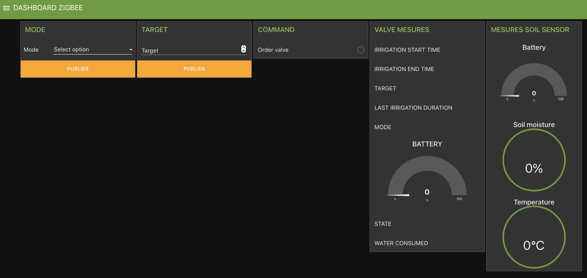

Vous trouverez ci-joint les flows Node-Red des TP IOT.

# TP BLE : flow-ble.json
## Régulation d'un arrosage de plante en pot.
Matériel :
- ESP32-H2 utilisant le BLE.
- Un capteur d'humidité du sol.
- Un relais 5V
- Une pompe 12V
- Une passerelle BLE2MQTT : https://github.com/bouhenic/BLE2MQTT
- Une raspberry pi

# TP ZIGBEE : flow-IrrZigbee.json
## Régulation d'un arrosage de plante en pot.
Matériel :
- Une raspberry pi.
- Un dongle Zigbee
- Un capteur d'humidité du sol ZIGBEE.
- Une électrovanne ZIGBEE
- Une passerelle ZIGBEE2MQTT : https://github.com/Koenkk/zigbee2mqtt.git

# TP ZIGBEE : flow-EclZigbee.json
## Éclairage commandé par télécommande.
Matériel :
- Une raspberry pi.
- Un dongle Zigbee
- Un capteur d'humidité du sol ZIGBEE.
- Une électrovanne ZIGBEE
- Une passerelle ZIGBEE2MQTT : https://github.com/Koenkk/zigbee2mqtt.git

