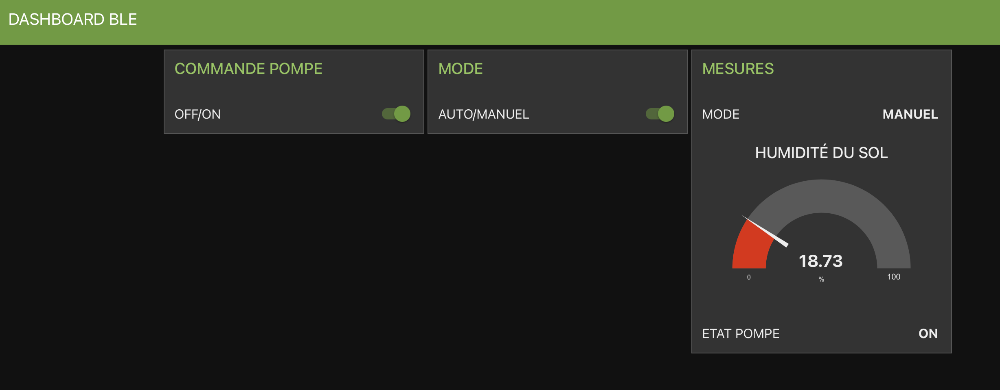

Vous trouverez ci-joint les flows Node-Red des TP IOT.

# TP BLE : flow-ble.json
## Régulation d'un arrosage de plante en pot.
Matériel :
- ESP32-H2 utilisant le BLE.
- Un capteur d'humidité du sol.
- Un relais 5V
- Une pompe 12V
- Une passerelle BLE2MQTT : https://github.com/bouhenic/BLE2MQTT

